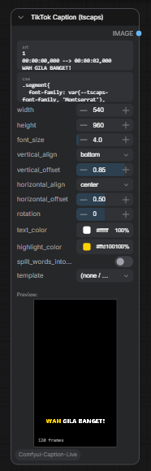

# Comfyui-Tiktok-Caption



ComfyUI custom node that renders CSS-styled captions and subtitles from SRT or plain text. Built on the [tscaps](https://github.com/francozanardi/tscaps) engine, with a 1:1 in-node live preview.

## Features

- CSS-styled caption rendering (font, color, shadow, outline, highlight animation)
- SRT input or plain text input (each line becomes a 2-second segment)
- 30 built-in templates (anya, cleo, freya, kai, luna, etc.)
- Live preview inside the ComfyUI node (native resolution, pixel-identical to output)
- Headless final render via CloakBrowser (Chromium) -- same engine, identical pixels
- Customizable: font size, rotation, text color, highlight color, alignment (vertical + horizontal)
- Output: IMAGE tensor (batch of frames) ready for video encoding downstream

## Installation

### ComfyUI Manager (recommended)

Search for "TikTok Caption" in ComfyUI Manager and install.

### Manual

```bash
cd ComfyUI/custom_nodes
git clone https://github.com/obvirm/Comfyui-Tiktok-Caption.git
cd Comfyui-Tiktok-Caption
pip install -r requirements.txt  # or: pip install numpy pillow cloakbrowser
```

### Comfy Registry

```bash
comfy node install comfyui-tiktok-caption
```

## How It Works

### Algorithm

1. **Input normalization** -- The node accepts either valid SRT (contains `-->`) or plain text. Plain text lines are converted to SRT segments with 2-second duration each.

2. **Document construction** -- The SRT string is parsed by tscaps' `SrtTranscriber` into an internal `Document` object containing timed subtitle segments.

3. **CSS styling** -- A style definition is built from the CSS input plus inline CSS variable overrides (from template defaults, font size, rotation, colors, alignment). The tscaps engine applies these styles using standard CSS -- fonts, colors, shadows, text-transform, letter-spacing, etc.

4. **Frame rendering** -- The engine renders each frame at the target timestamp by:
   - Laying out subtitle segments into the caption box (positioned via `verticalAlign`/`horizontalOffset`)
   - Splitting text into lines (balanced pixel width) and words
   - Applying CSS animations (highlight color transition during narration)
   - Drawing to an offscreen canvas at the exact output resolution

5. **Sampling** -- Frames are sampled at 30 FPS (fixed internal rate, not exposed). The engine walks the SRT timeline and renders one canvas per frame.

6. **Output** -- Preview returns `ImageBitmap[]` (direct canvas draw, no serialization). Final render returns PNG data URLs via CloakBrowser, decoded to `torch.Tensor` (N,H,W,3 float32 normalized to 0-1).

### Preview vs Output

Both paths use the exact same tscaps engine and vendored source. The only difference:

| Path | Environment | Return type |
|------|------------|-------------|
| Preview | Browser (ComfyUI frontend) | `ImageBitmap[]` drawn to canvas |
| Output | Headless Chromium (CloakBrowser) | PNG `bytes` -> `torch.Tensor` |

This guarantees pixel-identical output between preview and final render.

## Node Parameters

| Parameter | Type | Default | Description |
|-----------|------|---------|-------------|
| `srt` | STRING (multiline) | Sample SRT | SRT subtitle text or plain text |
| `css` | STRING (multiline) | DEFAULT_CSS | CSS for `.segment`, `.line`, `.word`, `.word.word-being-narrated` |
| `width` | INT | 540 | Output frame width in pixels |
| `height` | INT | 960 | Output frame height in pixels |
| `font_size` | FLOAT | 0 | Font size in `cqh` (% of frame height). 0 = use template/CSS default |
| `vertical_align` | ENUM | bottom | Caption anchor: `top`, `center`, `bottom` |
| `vertical_offset` | FLOAT | 0.85 | Vertical position (0.0 = top edge, 1.0 = bottom edge) |
| `horizontal_align` | ENUM | center | Horizontal anchor: `left`, `center`, `right` |
| `horizontal_offset` | FLOAT | 0.5 | Horizontal position (0.0 = left edge, 1.0 = right edge) |
| `rotation` | FLOAT | 0 | Text rotation in degrees (-180 to 180) |
| `text_color` | STRING | (empty) | Override text color (hex). Empty = use template default |
| `highlight_color` | STRING | (empty) | Override highlight color (hex). Empty = use template default |
| `template` | ENUM | (none / custom) | Select a built-in template (overrides CSS + colors) |

## CSS System

The caption engine uses standard CSS with `cqh` units (percentage of the caption frame height). This means font sizes scale proportionally with the output resolution.

### CSS Variables

Templates and the node expose these `--tscaps-*` variables:

| Variable | Purpose | Example |
|----------|---------|---------|
| `--tscaps-font-family` | Font family | `'Montserrat'` |
| `--tscaps-font-weight` | Font weight | `800` |
| `--tscaps-font-style` | Font style | `italic` |
| `--tscaps-font-size` | Font size (cqh) | `13cqh` |
| `--tscaps-letter-spacing` | Letter spacing (em) | `0.02em` |
| `--tscaps-word-spacing` | Word spacing (em) | `0.13em` |
| `--tscaps-line-spacing` | Line spacing (em) | `0.3em` |
| `--tscaps-text-align` | Text alignment | `center` |
| `--tscaps-text-transform` | Text case | `uppercase` |
| `--tscaps-text-decoration` | Text decoration | `none` |
| `--tscaps-rotation` | Text rotation (deg) | `0deg` |
| `--tscaps-primary-color` | Main text color | `#ffffff` |
| `--tscaps-highlight-color` | Word highlight color | `#ffd400` |
| `--tscaps-shadow-color` | Text shadow color | `rgba(0,0,0,0.6)` |
| `--tscaps-outline-color` | Text outline color | `#000000` |
| `--tscaps-quote-color` | Quote text color | `#e6d647` |

### Default CSS Structure

```css
.segment {
  font-family: var(--tscaps-font-family, 'Montserrat'), system-ui, sans-serif;
  font-weight: 800;
  font-size: var(--tscaps-font-size, 13cqh);
  color: var(--tscaps-primary-color, #ffffff);
  -webkit-text-stroke: 0.02em #000;
  paint-order: stroke fill;
}

.word.word-being-narrated {
  color: var(--tscaps-highlight-color, #ffd400);
}

.word.word-already-narrated {
  color: #e0e0e0;
}
```

The `.word-being-narrated` and `.word-already-narrated` classes are applied by the engine based on the current playback time. Templates use CSS animations on `.word` to create highlight transitions (e.g., color fade from primary to highlight during narration).

## Templates

30 built-in templates are included in `web/templates/`. Each template is a folder containing:

```
web/templates/anya/
  style.css      -- CSS rules for .segment, .line, .word, animations
  template.json  -- metadata + default values
```

### Template JSON Structure

```json
{
  "name": "Anya",
  "categories": ["clean"],
  "typography": {
    "fontFamily": "Playfair Display Variable",
    "fontWeight": 700,
    "fontSize": 2.97,
    "letterSpacing": 0.02,
    "wordSpacing": 0.13,
    "italic": true
  },
  "styleControls": [
    {
      "id": "primary-color",
      "label": "Text",
      "type": "color",
      "default": "#fff8e7"
    },
    {
      "id": "highlight-color",
      "label": "Highlight",
      "type": "color",
      "default": "#f5c982"
    }
  ],
  "segmentSplitters": [
    { "type": "boundary" },
    { "type": "limit_by_scaled_chars", "maxChars": 36 }
  ],
  "lineSplitter": {
    "type": "balanced-pixel-width",
    "maxLines": 2
  },
  "alignment": {
    "verticalAlign": "top",
    "verticalOffset": 0.75
  }
}
```

### Fields

- **typography** -- Maps to `--tscaps-*` CSS variables. `fontSize` is in `cqh` units (multiplied by 3.5 internally for vertical frames).
- **styleControls** -- Array of color/font controls. Each `id` maps to a CSS variable. The `default` value is used as the initial value.
- **segmentSplitters** -- How the engine splits subtitle text into segments. `boundary` splits on sentence boundaries; `limit_by_scaled_chars` caps segment length.
- **lineSplitter** -- How segments are split into visual lines. `balanced-pixel-width` with `maxLines` limits line count.
- **alignment** -- Default caption position inside the frame.

### Adding a New Template

1. Create a folder in `web/templates/` with the template name (lowercase, no spaces)
2. Add `style.css` -- define styles for `.segment`, `.line`, `.word`, and optionally `.word.word-being-narrated` animations
3. Add `template.json` -- define typography defaults, style controls, splitters, and alignment
4. The template automatically appears in the node's template dropdown

CSS variables use `var(--tscaps-*)` with fallback values so the template works even without the engine.

### Style.css Patterns

**Simple highlight animation (color flash):**
```css
.word {
  display: inline-block;
  margin: 0 0.13em;
  animation: highlight var(--word-being-narrated-duration)
    var(--on-word-being-narrated-starts) ease-in-out forwards;
}

@keyframes highlight {
  0%, 100% { color: var(--tscaps-primary-color, #fff); }
  20%, 80% { color: var(--tscaps-highlight-color, #ffd400); }
}
```

**Outline + shadow:**
```css
.segment {
  -webkit-text-stroke: 0.02em var(--tscaps-outline-color, #000);
  paint-order: stroke fill;
  text-shadow: 0 0.11em 0.47em var(--tscaps-shadow-color, rgba(0,0,0,0.6));
}
```

## Engine Attribution

This node uses a vendored copy of [tscaps](https://github.com/francozanardi/tscaps) by Franco Zanardi. The tscaps engine handles CSS-based subtitle rendering, text splitting, and frame drawing. The vendored source lives in `vendor/tscaps-engine/modules/`.

## Requirements

- Python >= 3.9
- numpy >= 1.20
- pillow >= 9.0
- cloakbrowser (auto-downloads Chromium on first use)
- Node.js (for building the frontend bundle only -- not required at runtime)

## License

MIT
